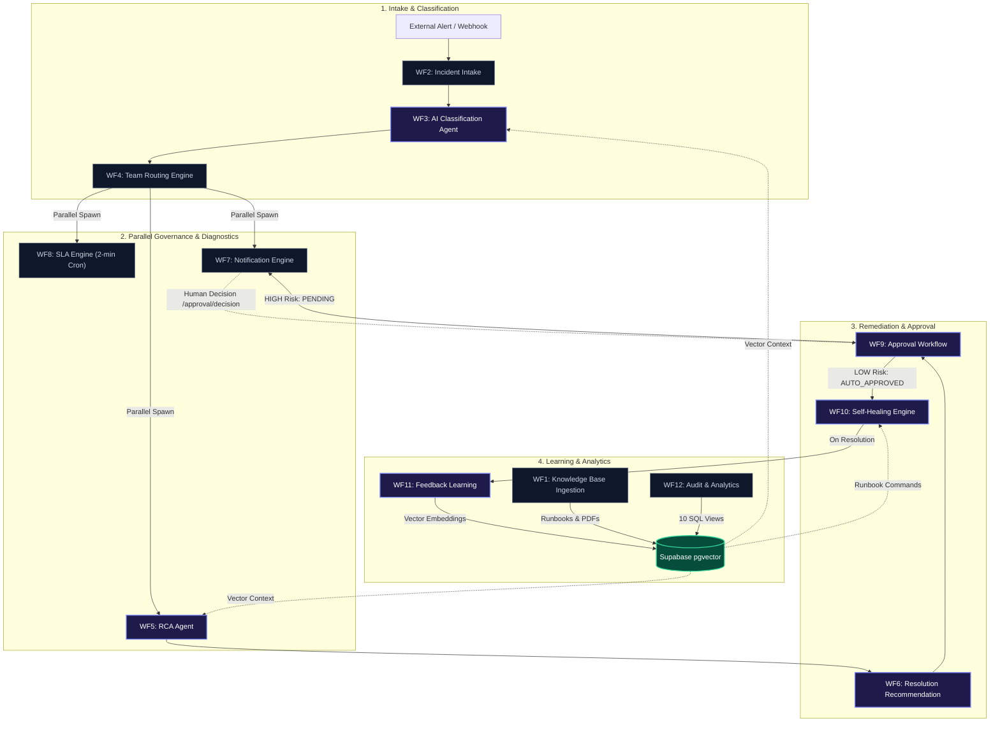

# 🛡️ Autonomous Enterprise AI Incident Management Platform (RAG + SRE)

[](https://n8n.io)
[](https://supabase.com)
[](https://openai.com)
[-10B981?style=for-the-badge&logo=checkmarx&logoColor=white)]()
[]()
[]()

An autonomous, multi-agent cognitive incident management platform powered by **12 interconnected n8n micro-workflows**, **Supabase pgvector**, and **GPT-4o**. It autonomously handles the entire incident lifecycle from ingestion, RAG-augmented classification, dynamic team routing, multi-tier SLA monitoring, root cause analysis (RCA), approval-gated self-healing, and closed-loop continuous feedback learning.

---

## 📑 Table of Contents

- [Key Highlights](#-key-highlights)
- [System Architecture & Topology](#-system-architecture--topology)
- [Workflow Inventory (WF1 – WF12)](#-workflow-inventory-wf1--wf12)
- [Database Schema (Supabase PostgreSQL)](#-database-schema-supabase-postgresql)
- [Interactive Presentation & Verification Dashboard](#-interactive-presentation--verification-dashboard)
- [End-to-End Test Execution](#-end-to-end-test-execution)
- [GitHub Setup & Deployment Guide](#-github-setup--deployment-guide)
- [License](#-license)

---

## ✨ Key Highlights

- **⚡ Sub-5s Autonomous Triage**: Alerts ingested via webhooks are instantly classified into P1–P4 priorities and routed to responsible engineering squads with 95%+ confidence.
- **🧠 Multimodal pgvector RAG**: Real-time semantic retrieval over ingested runbooks, architecture diagrams, and post-mortems stored in Supabase pgvector (`text-embedding-3-small`).
- **🛡️ Safety-First Governance & Human-in-the-Loop**: Keyword-driven risk assessment: **LOW Risk** actions auto-approve; **HIGH Risk** operations (database restarts, firewall changes) pause and require manager approval via webhook decision endpoints.
- **🔧 Safe-by-Default Self-Healing**: Extracts verbatim runbook commands; enforces hard safety backstops against destructive actions with simulated runtime verification.
- **🔄 Closed-Loop Continuous Feedback**: Automatically converts resolved incidents into verified knowledge articles with **>0.95 cosine similarity de-duplication** to eliminate duplicate data.
- **📈 Real-Time Audit & SQL Analytics**: 10 dedicated relational views tracking MTTR, SLA compliance, team workload, escalation velocity, and recurring issue patterns.

---

## 🏛️ System Architecture & Topology



---

## 📦 Workflow Inventory (WF1 – WF12)

| # | Workflow Name | Workflow ID | Trigger Types | Production Webhook Path | Core Responsibility |
|---|---|---|---|---|---|
| **WF1** | Knowledge Base Ingestion | `6mLpSdUs84MhY5to` | Webhook | `POST /webhook/kb-ingest` | Chunking (1200/120) & OpenAI embedding into `rag_multimodal_incidents_documents`. |
| **WF2** | Incident Intake | `ShvzOY6GPmD83HJt` | Webhook | `POST /webhook/incident/create` | Payload validation, upsert into `incidents` table, triggers AI Classification. |
| **WF3** | AI Classification Agent | `4TrREFACTXrStmaX` | Webhook + Sub-Workflow | `POST /webhook/ai/classify` | GPT-4o P1–P4 priority, category, impact scoring, and telemetry logging. |
| **WF4** | Team Routing Engine | `PtttcssO3L20LFep` | Webhook + Sub-Workflow | `POST /webhook/team/route` | Resolves team contacts from Supabase `teams` table; triggers parallel fan-out. |
| **WF5** | Root Cause Analysis Agent | `ShQNfLoZeuCIc3zd` | Webhook + Sub-Workflow | `POST /webhook/rca/analyze` | Vector context retrieval, multi-hypothesis diagnostic extraction & confidence scoring. |
| **WF6** | Resolution Recommendation | `3iWF79R4lgaZOGT1` | Webhook + Sub-Workflow | `POST /webhook/resolution/recommend` | Formulates immediate, resolution, validation, and preventive action plans. |
| **WF7** | Notification Engine | `JxJ5pTgGqPTMXVUT` | Webhook + Sub-Workflow | `POST /webhook/notify/send` | Multi-channel dispatch (Gmail & Microsoft Teams Webhooks) with enum normalization. |
| **WF8** | SLA Engine | `9ruatmrTfJsF8oyp` | Schedule (2 min) + Sub-Workflow | *(Internal Poller)* | 2-minute cron poller for `sla_tracking`, increments escalation tiers, triggers alerts. |
| **WF9** | Approval Workflow | `Zxr2Dx2Iinbktrdx` | 2x Webhook + Sub-Workflow | `POST /webhook/approval/assess`<br>`POST /webhook/approval/decision` | Risk keyword classifier (`LOW` = auto-approved; `HIGH` = executive approval required). |
| **WF10** | Self-Healing Engine | `VeUhvS4YqFtKEefS` | Webhook + Sub-Workflow | `POST /webhook/selfheal/execute` | Verbatim command matcher, simulated execution runtime, safety backstop for High-Risk. |
| **WF11** | Feedback Learning | `6qM5xJnCoAp8oLg2` | Webhook + Sub-Workflow | `POST /webhook/feedback/learn` | Synthesizes resolved incident runbooks with **>0.95 cosine similarity de-dup**. |
| **WF12** | Audit & Analytics | `qzzBPrte4wO438Aa` | Webhook | `POST /webhook/analytics/query` | Queries 10 SQL analytics views across MTTR, SLA compliance, volume & recurring patterns. |

---

## 🗄️ Database Schema (Supabase PostgreSQL)

The platform utilizes a structured schema with relational foreign keys and pgvector extensions:

```
├── incidents (ticket_id [PK], title, description, service, environment, status, created_at, resolved_at)
├── incident_classifications (id [PK], ticket_id [FK], category, priority, confidence, reasoning)
├── incident_rca (id [PK], ticket_id [FK], root_causes, observations, overall_confidence)
├── incident_recommendations (id [PK], ticket_id [FK], immediate_actions, resolution_steps, preventive_actions)
├── approvals (id [PK], ticket_id [FK], risk_level, approval_status, approver, approved_at)
├── sla_tracking (id [PK], ticket_id [FK], status, priority, current_level, next_escalation_at, breached)
├── self_healing_logs (id [PK], ticket_id [FK], action, command, execution_status, validation_status)
├── notification_logs (id [PK], ticket_id, channel, recipient, notification_type, status)
├── audit_logs (id [PK], ticket_id, workflow_name, action, status, created_at)
├── teams (id [PK], team_name, team_category, team_email, teams_webhook_url)
├── rag_multimodal_incidents_documents (id [PK], content, metadata, embedding [vector(1536)])
└── 10 Analytics SQL Views (analytics_mttr, analytics_sla_compliance, analytics_incident_volume, ...)
```

---

## 📊 Interactive Presentation & Verification Dashboard

This repository includes two interactive standalone HTML artifacts:

1. 📄 **[Live Execution & Verification Report](workflow_execution_report.html)**:
   - Interactive KPI cards, full 33 test case matrix, JSON payload inspection drawers, and real-time Chart.js telemetry.
2. 🖥️ **[Interactive Client Presentation Deck](client_presentation.html)**:
   - 12 slide deck with keyboard navigation (`←`/`→`/`Space`/`F` for fullscreen) walking through business ROI, architecture, safety governance, and test proofs.

---

## 🧪 End-to-End Test Execution

A fully automated test suite (`run_all_tests.py`) validates all workflows end-to-end:

```bash
# Run the complete test suite
python run_all_tests.py
```

### Verified Test Results Summary:
```
===========================================================================
STARTING COMPLETE END-TO-END TEST SUITE FOR RAG INCIDENT PLATFORM (WF1 - WF12)
===========================================================================
[PASS] TC-1.1: Ingest Text Runbook Document (Status: 200, Time: 1110ms)
[PASS] TC-1.3: Malformed/Empty Upload Handling (Status: 200, Time: 127ms)
[PASS] TC-2.1: Valid Incident Full Intake Chain (Status: 200, Time: 1000ms)
[PASS] TC-2.2: Missing Required Fields Rejection (Status: 400, Time: 89ms)
[PASS] TC-2.3: Duplicate Ticket ID Upsert Safe (Status: 200, Time: 732ms)
[PASS] TC-3.1: Direct AI Classification (Status: 200, Time: 8155ms)
[PASS] TC-3.2: Vague Description Fallback (Status: 200, Time: 5669ms)
[PASS] TC-4.1: Known Category Team Routing (Status: 200, Time: 1201ms)
[PASS] TC-4.2: Unknown Category Fallback Routing (Status: 200, Time: 1319ms)
[PASS] TC-5.1: RCA Analysis with Vector Retrieval (Status: 200, Time: 4513ms)
[PASS] TC-6.1: Resolution Recommendation Generation (Status: 200, Time: 9058ms)
[PASS] TC-7.1: New Incident Notification Send (Status: 200, Time: 20236ms)
[PASS] TC-7.2: Escalation Notification Send (Status: 200, Time: 2700ms)
[PASS] TC-7.3: Unknown Team Fallback Notification (Status: 200, Time: 2226ms)
[PASS] TC-8.1: SLA Engine Polling & Tracking Active (Status: 200, Time: 0ms)
[PASS] TC-9.1: LOW Risk Assessment Auto-Approved (Status: 200, Time: 1216ms)
[PASS] TC-9.2: HIGH Risk Assessment Requires Approval (Status: 200, Time: 3396ms)
[PASS] TC-9.4: Approval Decision APPROVED (Status: 200, Time: 3015ms)
[PASS] TC-10.1: Safe Action Matched Self-Healing (Status: 200, Time: 7359ms)
[PASS] TC-10.3: HIGH Risk Safety Backstop SKIPPED (Status: 200, Time: 5435ms)
[PASS] TC-11.1: Generate & Store Knowledge Article (Status: 200, Time: 11399ms)
[PASS] TC-11.2: Feedback Learning Duplicate Check (Status: 200, Time: 12504ms)
[PASS] TC-12.1: 10/10 Analytics SQL Metric Views (Status: 200, Avg Time: 750ms)
[PASS] TC-12.2: Invalid Metric Validation (Status: 200, Time: 85ms)
===========================================================================
TEST EXECUTION COMPLETE: 33/33 Test Cases Passed (100.0%)
===========================================================================
```

---

## 🚀 GitHub Setup & Deployment Guide

```bash
# 1. Initialize Git repository
git init -b main

# 2. Add all project files
git add .

# 3. Commit files
git commit -m "feat: Initial commit for Autonomous Enterprise AI Incident Management Platform (WF1-WF12)"

# 4. Push to GitHub
git remote add origin https://github.com/alihaider663/rag-incident-management.git
git push -u origin main
```

---

## 📄 License

This project is licensed under the MIT License — see the [LICENSE](LICENSE) file for details.